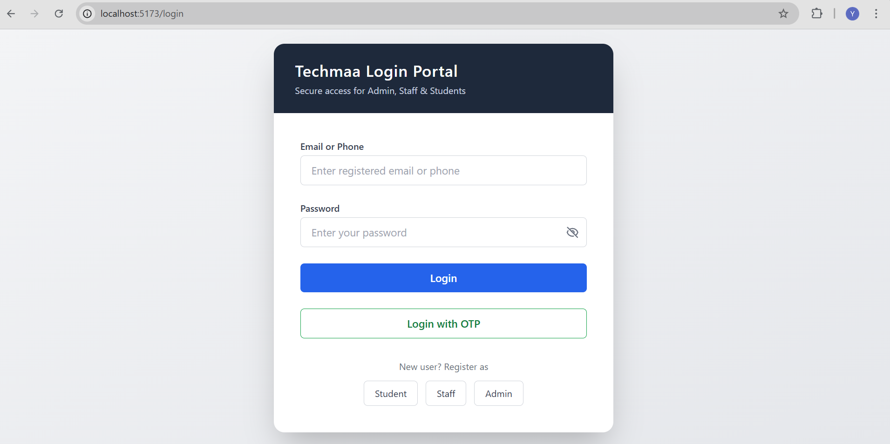
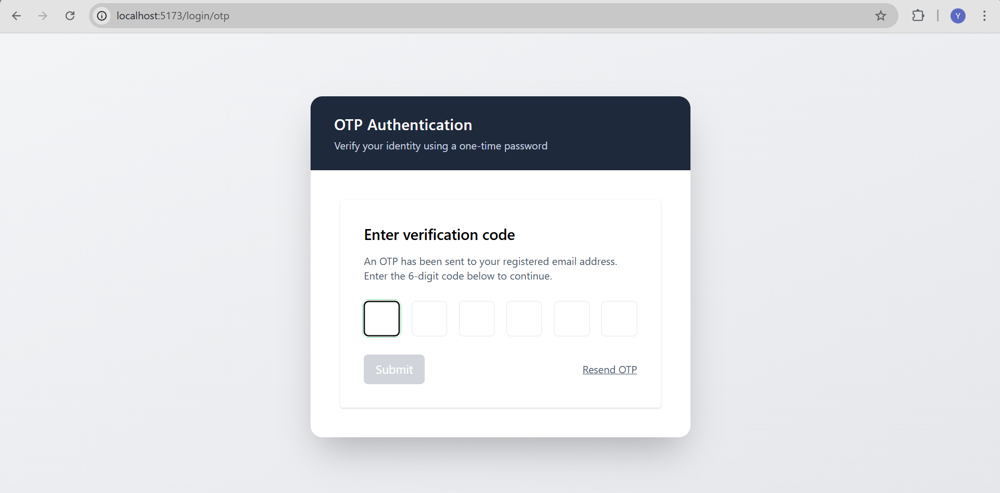
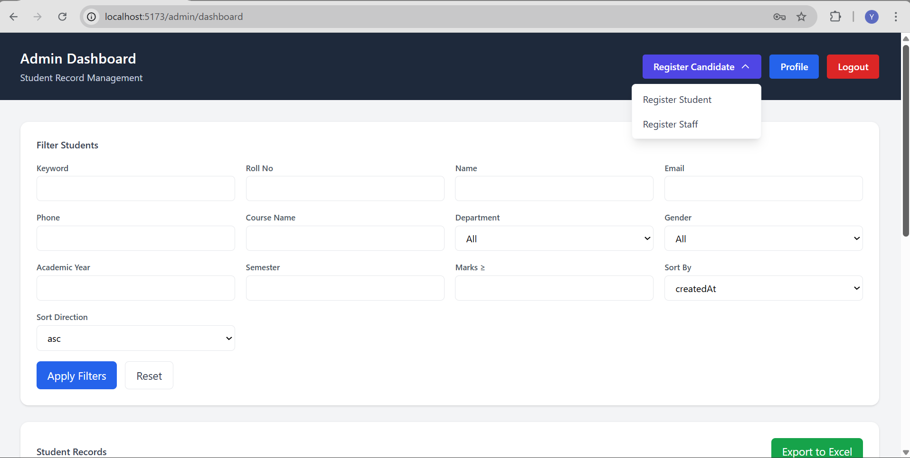
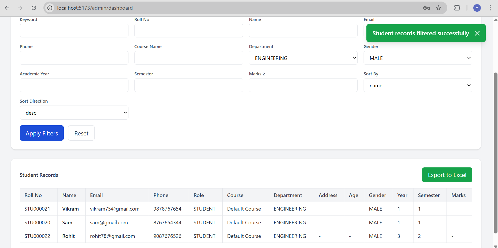
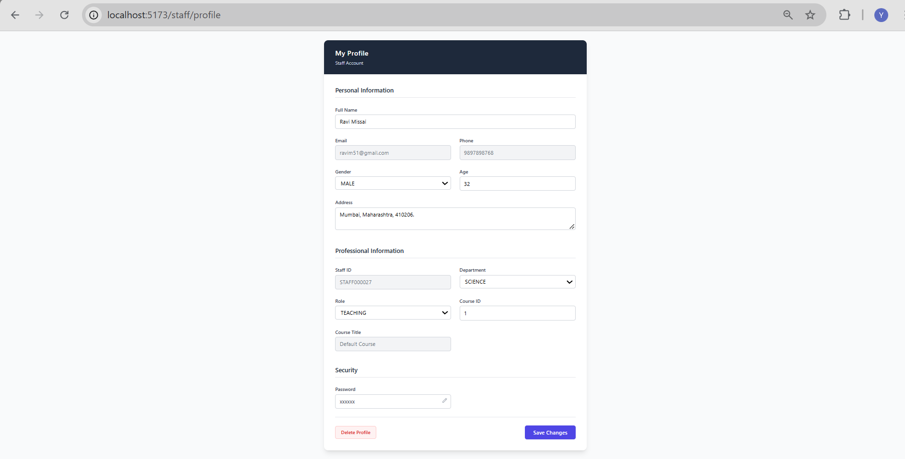
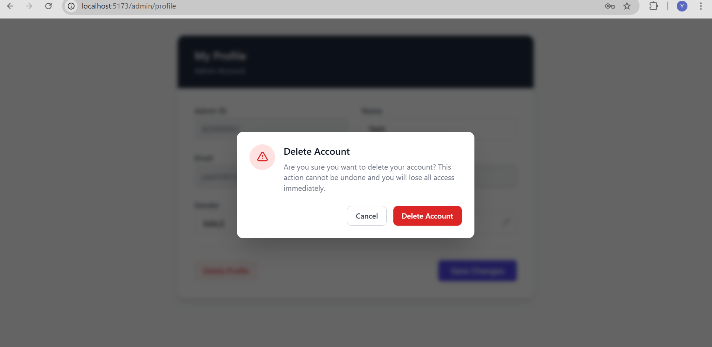

# 🎓 Techmaa Student Portal

[](https://opensource.org/licenses/MIT)
[](https://www.oracle.com/java/)
[](https://spring.io/projects/spring-boot)
[](https://react.dev/)

The **Techmaa Student Portal** is an enterprise-grade Student Record Management System (SRMS) designed to streamline academic data administration. Built on a robust full-stack architecture, the system provides a centralized hub for administrators to manage records while offering personalized dashboards for students and faculty.

Unlike standard CRUD applications, this portal incorporates **Role-Based Access Control (RBAC)**, secure **JWT-based authentication** with HttpOnly cookies, and a secondary **Redis-backed OTP login system** for enhanced security.

---

## 1.🚀 Key Features

* **Multi-Role Authentication:** Dedicated access levels and unique UI views for Admin, Staff, and Students.
* **Secure Auth Flow:** Implements JWT tokens stored in HttpOnly cookies and MFA via email-based OTPs.
* **Dynamic Data Filtering:** Advanced administrative search using keyword-based specifications (Name, Roll No, Department, etc.).
* **Automated Reporting:** Generate and download formatted Excel reports using **Apache POI**.
* **Data Integrity:** Implements **"Soft Deletes"** to preserve database history.
* **Responsive UI:** A modern dashboard built with **Tailwind CSS** and real-time notifications.

---
## 🖼️ Application Screenshots

### 🔐 Authentication Portal (Password & OTP Login)
**Authentication Portal (Password & OTP Login)**  
Secure entry point supporting credential-based login and Redis-backed OTP authentication for Admin, Staff, and Students.



---

### 🔑 OTP Verification Flow

**OTP Verification Flow**  
Email-based one-time password verification with resend support and time-bound validation for enhanced security.



---

### 🛠️ Admin Dashboard – Student Record Management

**Admin Dashboard – Student Record Management** 

Centralized administrative interface featuring advanced filtering, sorting, role-based actions, and Excel export capabilities.



---
### 🔍 Filtered Student Results

**Applied Student Filters** 

Displays the filtered results in student records table after applying multiple filter criterias, reflecting the narrowed dataset based on the selected parameters.



---

### 👨‍🏫 Staff Profile

**Staff Profile Management**  

Role-specific profile view enabling controlled updates to personal and professional information under RBAC constraints.



---

### ⚠️ Account Safety
**Account Deletion Confirmation**  
Explicit confirmation flow for irreversible actions, ensuring user intent validation and preventing accidental data loss.



---

## 2.🛠 Tech Stack

### Software Architecture


| Layer | Technologies |
| :--- | :--- |
| **Frontend** | React.js (Vite), Tailwind CSS, React Router, Context API |
| **Backend** | Java 17, Spring Boot 3.x, Spring Security |
| **Database** | MySQL (Primary), Redis (Cache/OTP) |
| **Security** | JWT (JSON Web Token), BCrypt, HttpOnly Cookies |
| **DevOps/Tools** | Maven, Lombok, Apache POI (Excel) |

---

## 3.📐 Architecture Overview

The application follows a clean, decoupled architecture:

1.  **Backend (Layered):**
    * **Controllers:** REST API endpoints handling request/response mapping.
    * **Services:** Business logic and transactional management.
    * **Repositories:** Interface for JPA-based database interactions.
2.  **Frontend (Component-Based):**
    * **Context:** Global state management for authentication and notifications.
    * **Services:** API abstraction layer using the Fetch API.

---

## 4.⚙️ Installation & Setup

### Prerequisites
* **Java JDK 17+**
* **Node.js v18+**
* **MySQL Server** (Running on 3306)
* **Redis Server** (Running on 6379)

### 5. Backend Configuration
Navigate to the backend folder and configure your `src/main/resources/application.properties`:

```properties
# Database Configuration
spring.datasource.url=jdbc:mysql://localhost:3306/techmaa_db
spring.datasource.username=YOUR_USER
spring.datasource.password=YOUR_PASSWORD

# Redis Configuration
spring.data.redis.host=localhost
spring.data.redis.port=6379

# JWT & Mail Secrets
jwt.secret=${JWT_SECRET_KEY}
spring.mail.host=smtp.gmail.com
spring.mail.port=587
spring.mail.username=${EMAIL_SENDER_USERNAME}
spring.mail.password=${GMAIL_APP_PASSWORD}
```
### Run Backend Server

Run the following commands in the root of your backend directory:

```bash
mvn clean install
mvn spring-boot:run
```
## 6. Frontend Configuration

1. Navigate to the frontend folder.
2. Install dependencies:
   ```bash
   npm install
   ```
3. **Start the development server**:
   ```bash
   npm run dev
   ```
## 7.📑 API Documentation

The system exposes several key REST endpoints:

| Method | Endpoint                              | Access  | Description                              |
| :----: | ------------------------------------- | :-----: | ---------------------------------------- |
| POST   | `/auth/login-user`                    | Public  | Standard password-based login            |
| POST   | `/auth/login/generate-otp`            | Public  | Initiates OTP generation for email login |
| POST   | `/admin/register-student`             | Admin   | Registers a new student record           |
| GET    | `/admin/students/filter`              | Admin   | Search / filter students with sorting    |
| GET    | `/admin/students/filter/export/excel` | Admin   | Export current filters to Excel          |
| GET    | `/student/profile`                    | Student | Fetch authenticated student profile      |
| PATCH  | `/staff/profile/update`               | Staff   | Update staff member information          |

## 8. Usage Guide
1. **Administrative Setup**: Register an admin account via /register/admin.

2. **Student Onboarding**: Admins can register students from the dashboard or students can self-register.

3. **Authentication**: Users can choose between secure password login or OTP-based login (requires Redis and SMTP configuration).

4. **Data Export**: As an Admin, use the filter bar to isolate records and click "Export to Excel" to download the .xlsx report.

## 9.🤝 Contributing
1. **Fork** the Project.

2. **Create your Feature Branch**:

```Bash

git checkout -b feature/AmazingFeature
```
3. **Commit your Changes**:

```bash

git commit -m 'Add some AmazingFeature'
```
4. **Push to the Branch**:

 ```bash

  git push origin feature/AmazingFeature
```
5. **Open** a Pull Request.
